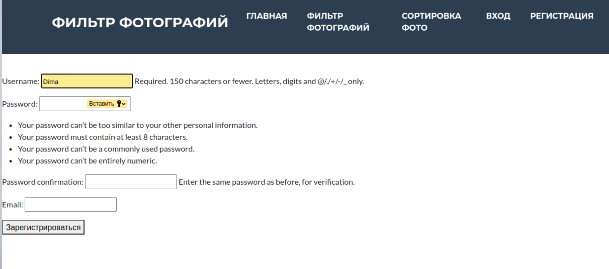
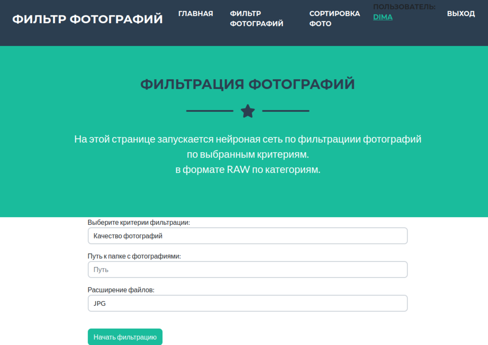
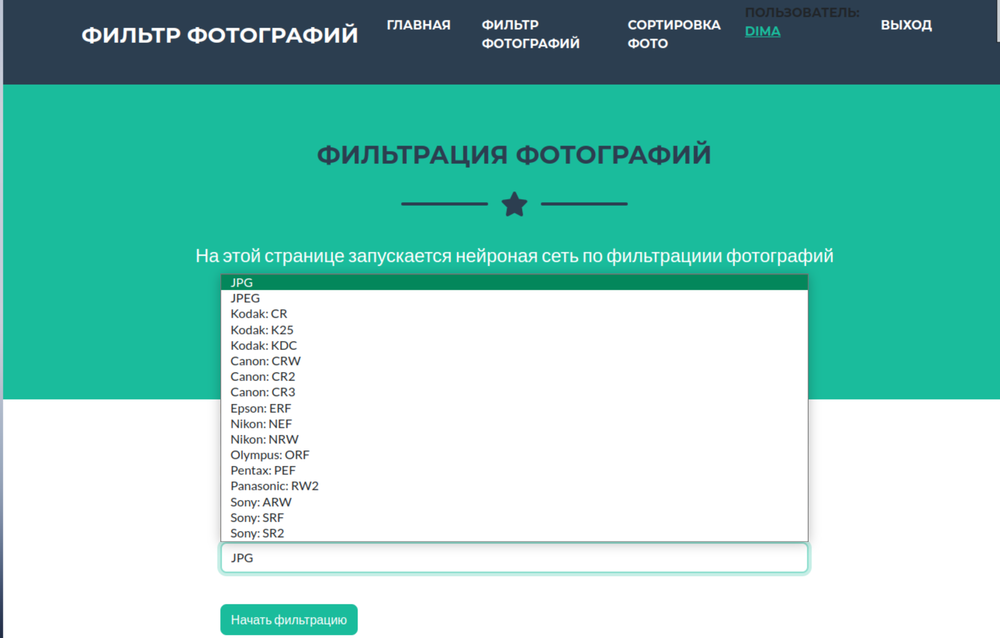
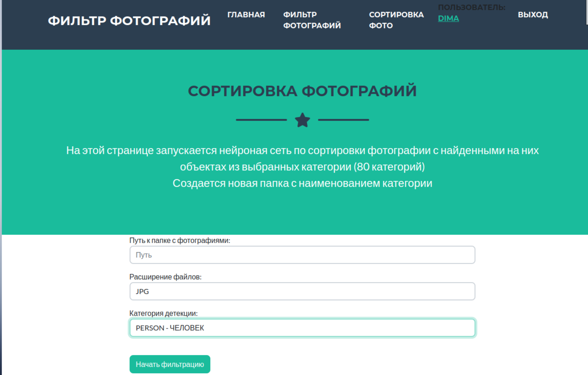
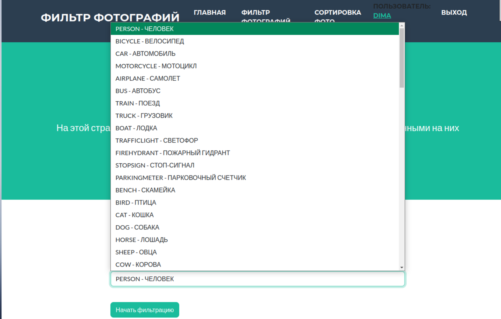

# Сервер фильтрации и сортировки фотографий
## О системе
Данная система представляет собой набор нейроных сетей выполняющие разные задачи:
1. Фильтрация фотографий по качеству 
   2. Fokus - фотографии без фокуса
   3. Good_foto - хорошие фотографии (нормаьная освещеность, резкость и фокусировка)
   4. Peresvet - фотографии с засветкой
   5. Temniy - темные фотографии
6. Фильтрация фотографий людей по критерию открытых глазам
7. Сортровка фотогрфий  
   Сортировка фотографий происходит по 80 категориям, если на фотографии присутствует объект, выбранный из списка, то такая фотография помещается в отдельно созданную папку, с именем категории фильрации
Система работает со всеми форматами файлов RAW, JPG, JEPG

## Установка 
Для работы с сервером рекомендуется использование PyCharm
1. Клонируем репозиторий GIT:
```commandline
git clone https://github.com/nosovdmitry007/Photo_filter.git -b Add_closes_yeys
```
2. Устанавливаем необхоимые библиотеки:
```commandline
  pip install --upgrade pip
  cd Photo_filter
  pip install -r requirements.txt
```
3. Необходимо загрузить [веса](https://github.com/ultralytics/yolov5/releases/download/v6.2/yolov5m.pt) моделей в папку model
```
├── model 
│   ├── best_model_87.3.h5
│   ├── yolov5m.pt
```
4. Запускаем сервер: 
```commandline
python manage.py runserver
```
5. Необходимо Зарегестрировать нового пользователя 








